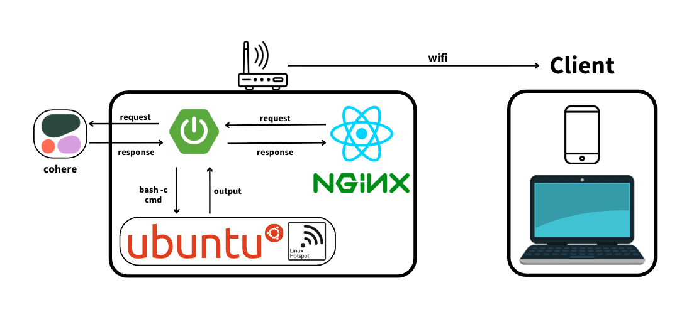
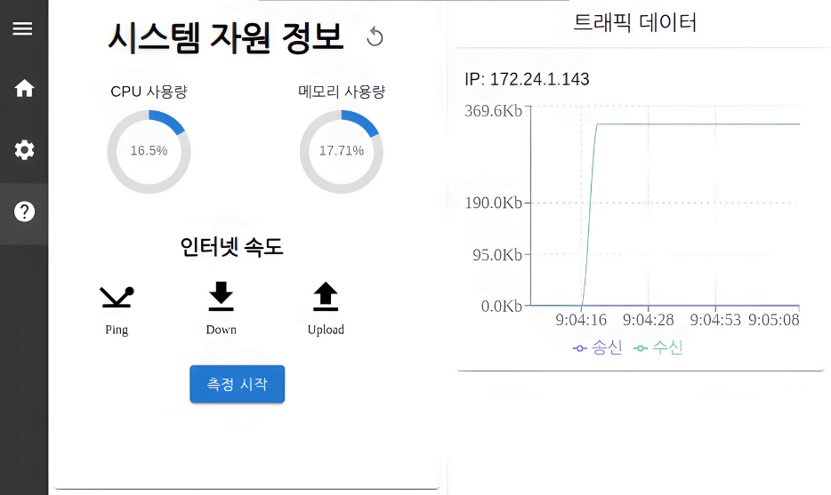
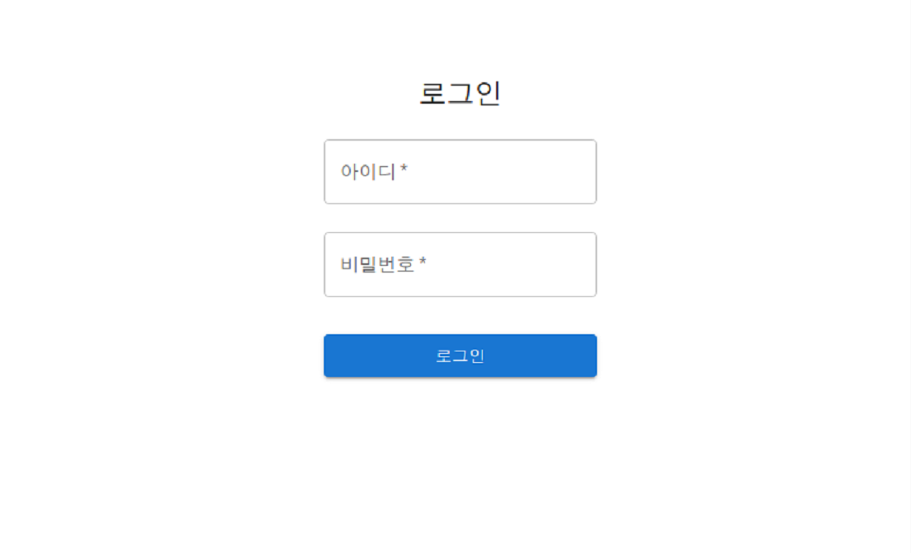
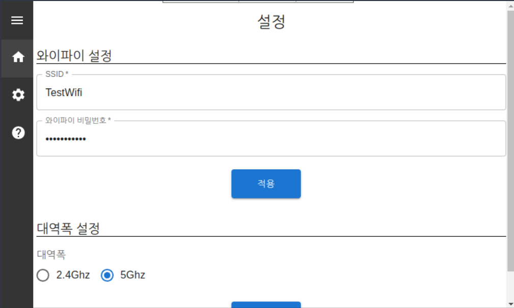
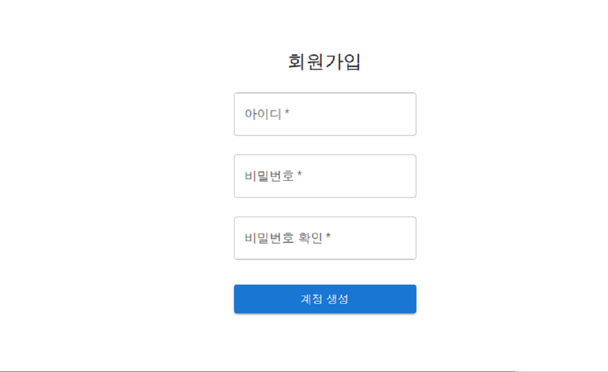
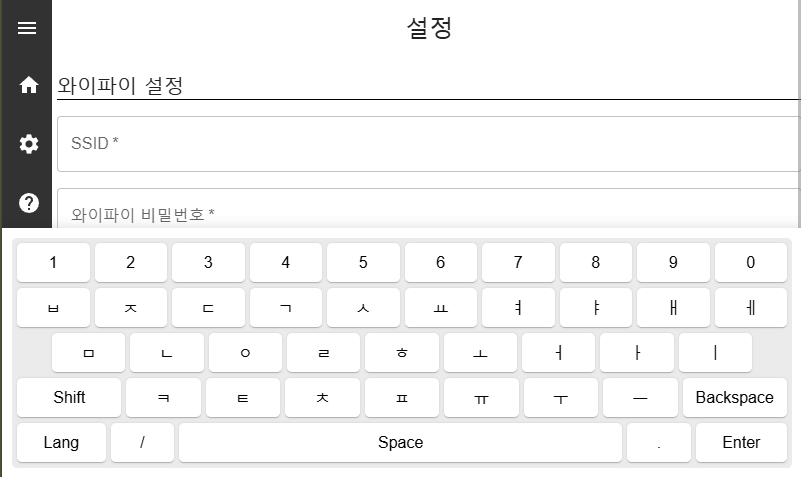

# 🖥️ 디스플레이 탑재형 스마트 공유기 관리 시스템 (Front-End)

본 프로젝트는 복잡한 공유기 설정에 익숙하지 않은 사용자들을 위해, 디스플레이를 탑재하여 설정 안내와 보안 변경을 시각적으로 제공하는 **사용자 친화적인 스마트 공유기 시스템의 프론트엔드**입니다.

사용자는 웹 기반 대시보드를 통해 실시간으로 공유기 상태를 모니터링하고, 디스플레이 화면에서 직관적으로 설정을 관리할 수 있습니다.

> 본 프로젝트를 바탕으로 **ICGHIT 2025** 국제 학회에 논문을 제출했습니다.
> - **논문 제목**: Design and Implementation of a User-Friendly Smart Router  
> - **Notion Link**: [ICGHIT 2025 논문 페이지](https://crystal-belly-617.notion.site/ICGHIT-2025-2a21928ec316804ebb9bd3673d6b230a?pvs=74)

---

## 🛠️ 사용 기술 스택

| 구분 | 기술 |
| --- | --- |
| **Frontend** | React, Material-UI, Styled-components |
| **상태 관리** | Recoil |
| **API 통신** | Axios, Server-Sent Events (SSE) |
| **개발 환경** | Vite, ESLint |

---

## 시스템 아키텍처

  

---

## 주요 개발 기능

### 1. 실시간 시스템 모니터링 대시보드
공유기의 CPU, 메모리, 네트워크 사용량 등 시스템 자원을 실시간으로 시각화합니다.

- **실시간 데이터 수신**: **SSE (Server-Sent Events)**를 도입하여 서버로부터 실시간 데이터를 스트리밍 방식으로 수신합니다.
  
- **안정적인 연결성**:
  - **자동 재연결**: 네트워크 연결 실패 시 5초 간격으로 최대 5회 자동 재시도 메커니즘을 구현했습니다.
  - **에러 핸들링**: 데이터 파싱 오류나 네트워크 오류 발생 시, 사용자 친화적인 오류 메시지를 제공합니다.
    
- **데이터 시각화**: (Recharts 활용)
  - CPU 및 메모리 사용량: 원형 차트 (Circular Progress)
  - 네트워크 트래픽 변화: 선형 그래프 (Line Chart)

### 2. 사용자 친화적인 웹 가상 키보드
공유기 디스플레이 환경에서 터치 입력을 통한 설정 편의성을 높이기 위해 웹 기반 가상 키보드를 구현했습니다.

- **다국어 및 한글 조합**:
  - 한글/영문 전환 기능을 지원합니다.
  - `hangul-js` 라이브러리를 활용하여, **자연스러운 한글 조합 입력**이 가능하도록 구성했습니다.
- **UX (사용자 경험) 개선**:
  - 입력 필드 포커스 시 키보드가 자동으로 표시되고, 외부 클릭 시 자동으로 숨겨집니다.
  - `useRef`를 활용하여 키보드가 활성화될 때 **입력 필드가 가려지지 않도록 화면을 자동으로 스크롤**하는 기능을 구현, 사용자 입력 편의성을 향상했습니다.

---

## 서비스 화면

<table>
  <tr>
    <td align="center"> <b>대시보드</b> </td>
    <td align="center"> <b>로그인 페이지</b> </td>
  </tr>
  <tr>
    <td align="center"> <b>설정 페이지</b> </td>
    <td align="center"> <b>초기 회원가입 화면</b> </td>
  </tr>
  <tr>
    <td align="center" colspan="2"> <b>키보드 레이아웃</b> </td>
  </tr>
</table>
